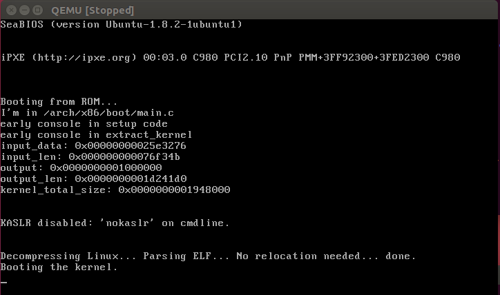
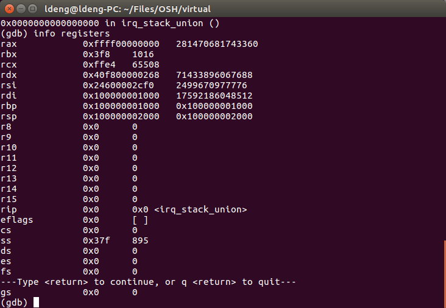
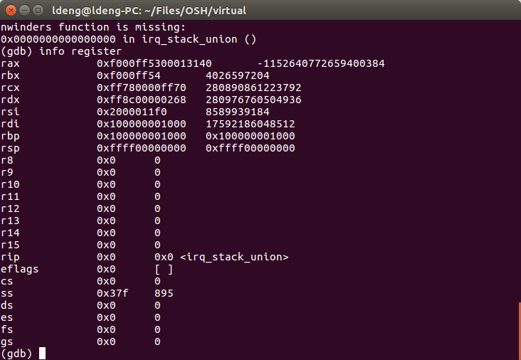
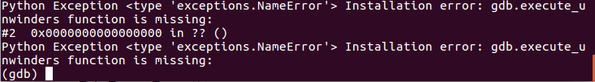
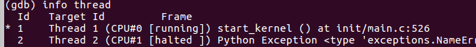

# OSH实验一实验报告

作者：邓龙 学号：PB16110675

## 实验内容
请使用调试跟踪工具，追踪自己的操作系统（建议Linux）的启动过程，并找出其中至少两个关键事件。

## 实验环境
操作系统：Ubuntu 16.04
调试内核版本：4.15.14
编译器：gcc version 5.4.0 20160609 (Ubuntu 5.4.0-6ubuntu1~16.04.9)
调试器：GNU gdb (GDB) 8.1
虚拟机：qemu 2.5.0

## 实验方法及过程

大致按照了参考文献[1]的内容。

### 编译内核

使用命令编译内核

    make menuconfig
    <save>
    make bzImage

使用dracut生成initramfs文件

    dracut init.img 4.15.14
    chmod 666 init.im

### qemu与gdb的配置
    
按参考文献[1]中方法修改gdb源码并编译，解决 g_packet 过长的问题

新建start.sh用作启动，代码如下

    #!/bin/bash
    qemu-system-x86_64 -kernel ./bzImage -initrd ./init.img -smp 2 -gdb tcp::1234 -m 1024 -append "console=ttyS0 earlyprintk=ttyS0,115200 nokaslr debug" -S

其中 console 和 earlyprink 参数配置了内核启动中早期过程中的串口输出，debug参数会使内核启动过程中额外输出一些信息

### 尝试开始调试

运行 ./start.sh 启动qemu
在新的终端中运行

    gdb vmlinux
    
启动gdb并导入 vmlinux中的符号表

在gdb中运行

    list
    info source
    
发现gdb在开始调试时已经进入 linux/init/head_64.S ，而符号表中能找到的运行最早的符号应为 start_kernel， 这给start_kernel之前的调试带来了困难。
考虑到除去引导部分，内核启动时应从linux/arch/x86/boot/head.S 开始，而第一个C语言代码在 arch/x86/boot/main.c 阅读代码，在拷贝参数后，早期的控制台已经启动，而通过gdb在start_kernel处设置断点，观察控制台输出，有

    early console in setup code

这是main.c中两行代码的结果，在qemu启动中，我们给命令行加入了debug参数，早期控制台初始化完毕后输出了信息。

    if (cmdline_find_option_bool("debug"))
        puts("early console in setup code\n");

故从此行之后可利用puts即时向控制台输出信息进行调试。
修改内核代码重新编译，在main函数中输出“I'm in /arch/x86/boot/main.c” 作为测试，结果如下：

看到在bios将控制权交给内核后，输出了如上字符串。

### 关键事件1

arch/x86/boot/main.c 中 main 函数开始运行即为第一个关键事件。
/boot/main.c 是系统运行中第一个运行的C语言函数。各种设备的初始化基本都是在此执行的，包括

* 1 console_init() 控制台初始化，这也是我们能够进行调试的基础
* 2 keyboard_init() 键盘初始化
* 3 set_video() 视频模式初始化，开始支持VGA等接口显示

即内核有了基本的输入输出能力。

同时，该函数还进行了很多操作，包括
* 1 copy_boot_params() 拷贝启动参数
* 2 init_heap() 全局堆和堆栈的初始化
* 3 validate_cpu() 检测cpu
* 4 set_bios_mode() 不太明白，按照注释，告诉bios我们希望cpu以什么模式运行
* 5 detect_memory() 检测内存分布
* ……

在main函数的最后，它启动了我们下一步要跟踪的关键事件go_to_protected_mode()

为了查看在函数main中cpu的状态，我在console_init之后加上while(1),强行暂停了内核的启动。
然后用gdb查看寄存器状态，寄存器状态如下：

rcx中应为数据段描述符索引，这是实模式中代码放置的，在切换到保护模式的过程中起到作用[2]。

### 关键事件2

如上所述，关键事件2为go_to_protected_mode()的调用，该函数在pm.c中定义。
阅读代码arch/x86/boot/pm.c，go_to_protected_mode()函数在进行各种准备工作后（包括堆中断向量表和实模式的一些操作，以及设置中断描述符和全局描述符[2]，这些操作大部分是用汇编指令完成的，所以不是非常明白），函数调用了

    protected_mode_jump(boot_params.hdr.code32_start,
			    (u32)&boot_params + (ds() << 4));

正式进入保护模式。
与main函数中一样，我在上面一行调用之前加上了while(1)，重新编译内核，来查看虚拟机的状态。
寄存器状态如下：

可以看到，eax和edx储存了该函数的两个参数[2]。

### 关键事件3

切换到保护模式后，cpu进入了32位模式。然后过渡到长模式，即64位模式。之后进行内核解压缩。
这一部分代码大部分是用汇编语言写的，我能力有限，就暂且跳过了。
那么系统就运行到了我们开始使用gdb时，info source所指向的位置。即架构无关的内核代码的开始init/head_64.S。该文件也是一个汇编文件，在多次回到arch/x86/kernel/head64.c等地方执行后，最后head_64.S调用了start_kernel函数。
这个地方gdb已经可以进行断点调试了，我们的跟踪变得轻松起来。这也是我所跟踪到的第三个关键事件。

先来看看调用栈

start_kernel是由head_64.S调用的，与前述一致。

看看线程情况

之前qemu设置了两个cpu，现在cpu1处于halt状态，只有cpu0运行着start_kernel，也符合预期。

利用next和step进行单步调试，start_kernel运行了很多函数。一个值得注意的问题是，运行完pr_notice函数后，控制台似乎并没有出现显示。
利用

    print linux_banner

查看变量

    $2 = 0xffffffff81e00080 <linux_banner> "Linux version 4.15.14 (ldeng@ldeng-PC) (gcc version 5.4.0 20160609 (Ubuntu 5.4.0-6ubuntu1~16.04.9)) #6 SMP Sun Apr 1 21:57:13 CST 2018\n"
    
变量的值并没有问题。发现几行之后要运行

     console_init()

在这个函数设置断点，并运行continue。发现在这个函数运行之前都没有信息输出。
而在该断点finish，运行完此函数，qemu屏幕上突然显示出许多信息。可见该函数初始化了控制台，之前缓冲区中的信息都写到了屏幕上。

start_kernel的最后，进入了rest_init进行其他设置。
rest_init也在main.c里，其启动了两个新的进程：kernel_init和kthreadd，他们分别为系统进程和用户进程的祖先。

## 结语

本次实验时间比较紧张，做得比较仓促，所以很多地方没有仔细跟踪，只是大致了解了启动过程的大概。希望以后有机会补全。

## 参考文献

[1]  http://www.cnblogs.com/chineseboy/p/4216521.html 
[2]  https://www.gitbook.com/book/xinqiu/linux-insides-cn
